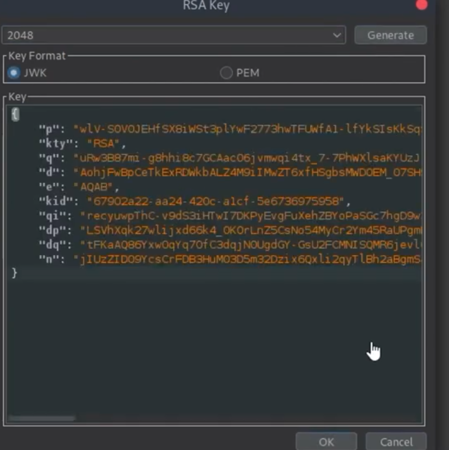
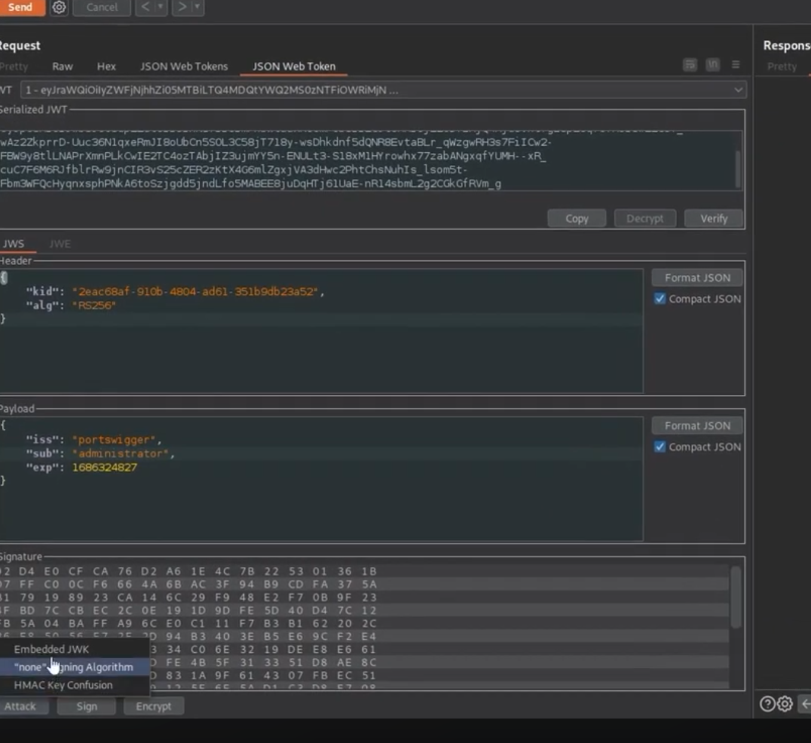
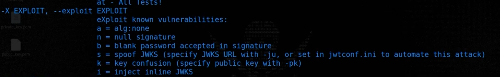
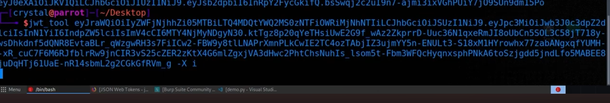
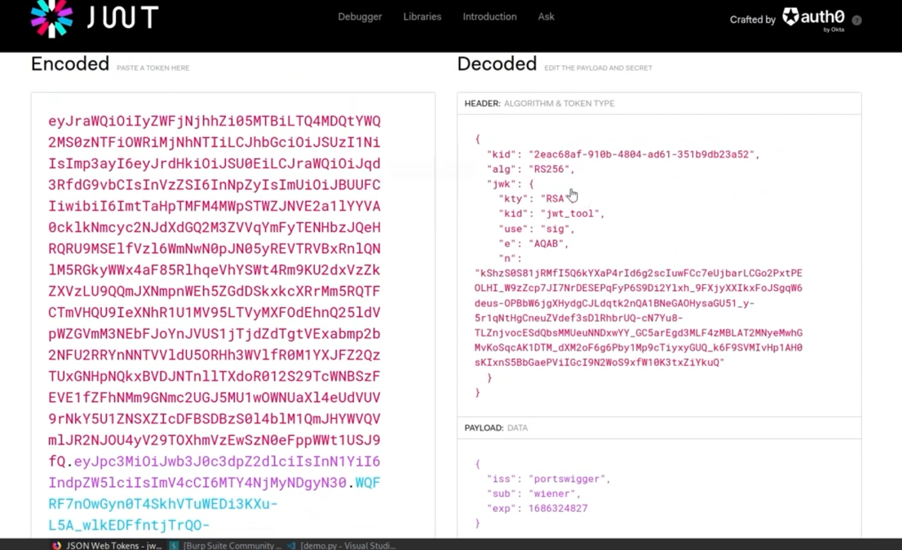
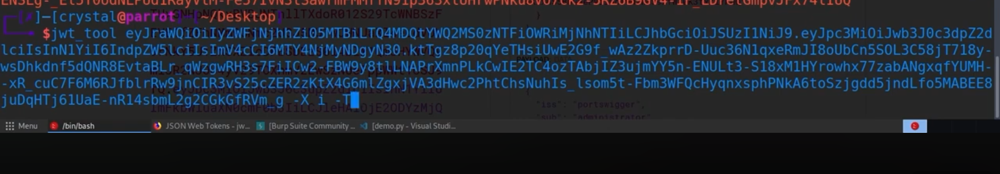
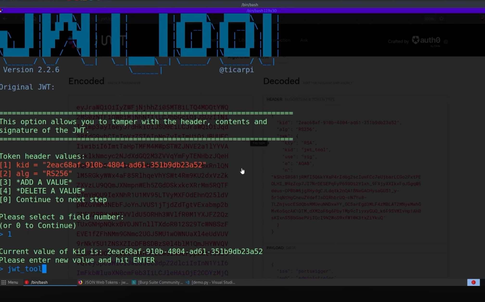

🧠 What the lab is saying (in simple words)

👉 The website uses JWT for login
👉 It allows jwk in header (key inside token)
👉 ❌ But it does NOT check if the key is trusted

🎯 What is the mistake?

👉 Server does this:

"Oh, you sent a key in JWT (jwk)?  
I will use it to verify your token 👍"

👉 Problem:
That key is controlled by YOU (attacker) 😳

🔥 What you can do

👉 You can:

Create your own key pair
Put your public key inside JWT (jwk)
Sign token with your private key
Send to server

👉 Server will:

Use YOUR public key
Verify signature
Accept token ✅
🎉 Result

👉 You can make:

{ "sub": "administrator" }

👉 And get access to:

/admin

## port Swigger

 >> Embedded JWK >> Algo -RS256

JWT_Tool

 

Tamper change the User name to Administrator 
out side KID is not same in inside jwk kid, ideally it should be same

