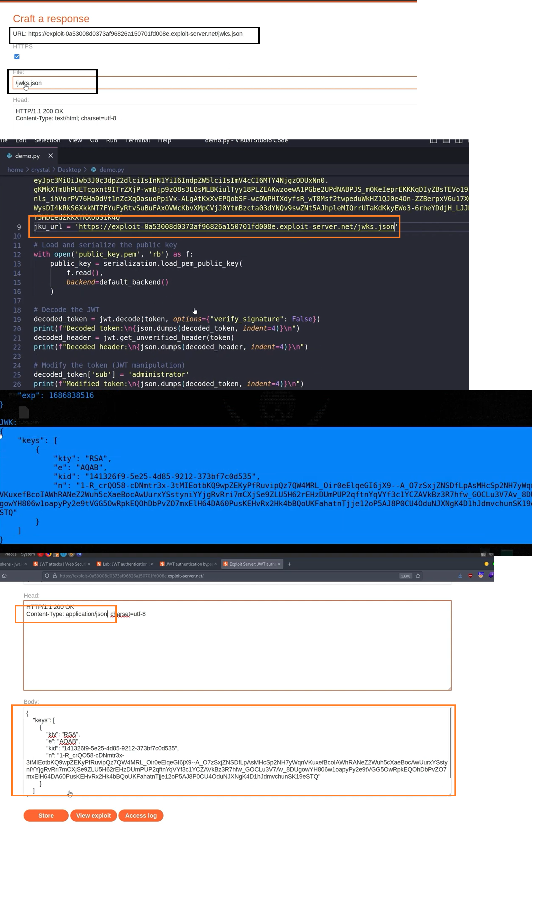
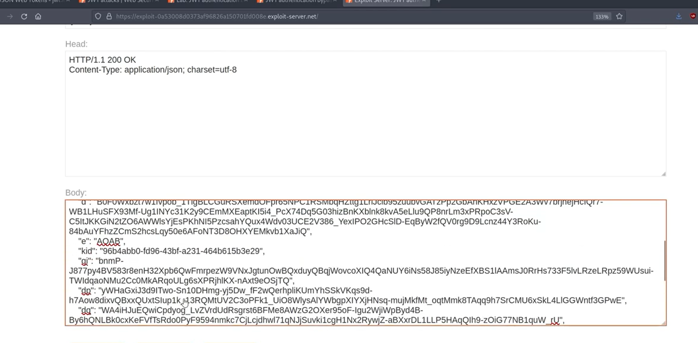

python

Port Swigger 

Go to JSON Editors Keys >> New RSA Key >> Generate JWK
Paste in to Exploit Server of Portswigger & copy the KID 

In Request, Go to JSON Web Token
paste the Kid in JWS header 
& also in JWS Header the 'jku":"exploitserver url"

In pay load rename sub to admininistrator
> Sign & Send

JWT_Tool

cpoy the json paste into exploit server > store ir

