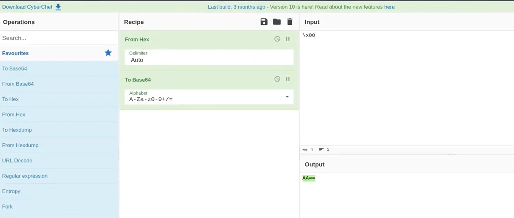
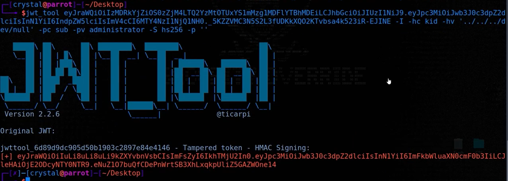

Port Swigger

Go to JSON Editor Key > Generate the New Symmetric key 
Replace k with \x00 -> base64 value -> AA==

Go Request >> Json Web Token update "kid": "../../../dev/null"
go to Sign 

JWT_Tool

